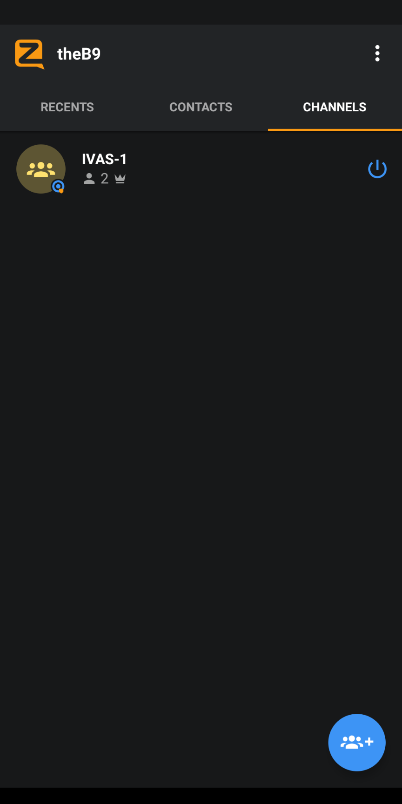
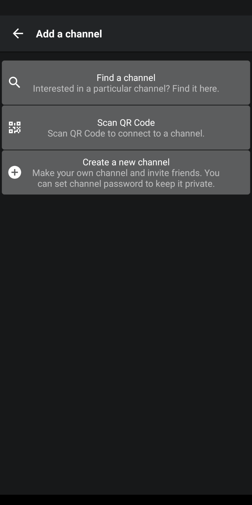
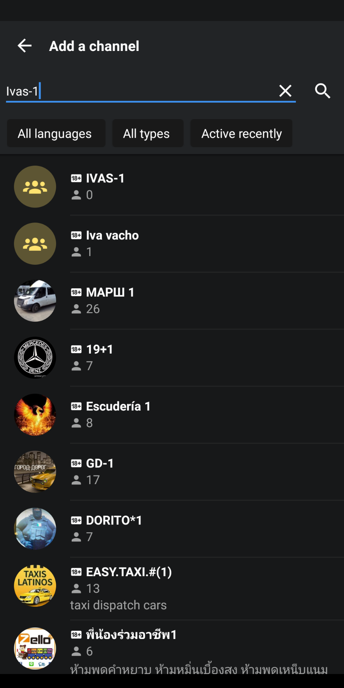

## Sign In to Ivas Zello Channel

1. Download [Zello](https://play.google.com/store/apps/details?id=com.loudtalks&hl=en_US&gl=US) from the PlayStore
1. Open Zello and sign in
1. Click on channel tab

1. Click Add Channel fob
1. Click on find channel
-
1. enter Ivas-1 and click on Ivas-1 when it shows up

1. enter Ivas#event for the password when prompted
